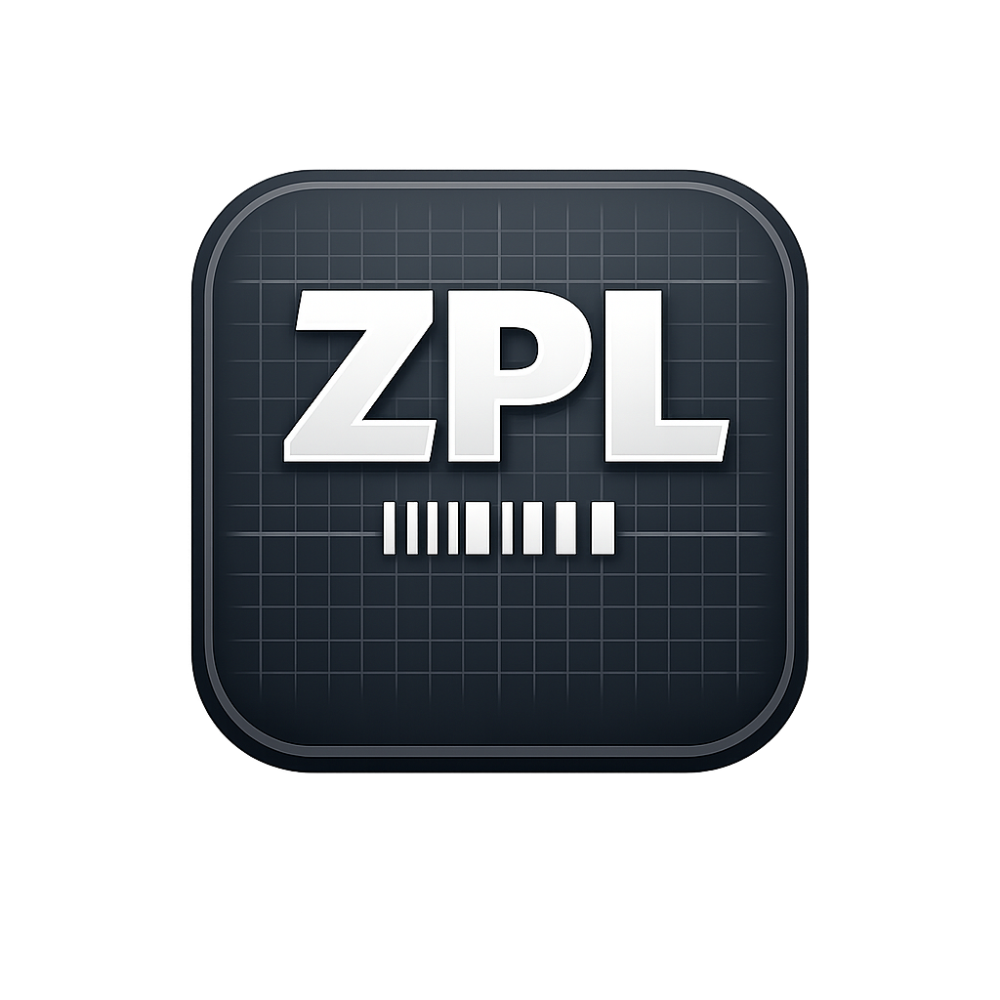
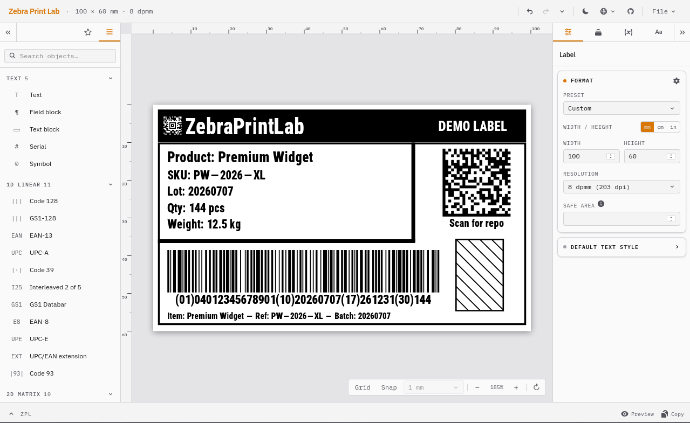

# ZebraPrintLab



[](https://github.com/u8array/ZebraPrintLab/actions/workflows/deploy.yml)

A browser-based visual editor that generates ZPL for Zebra printers.

Writing ZPL by hand is tedious: cryptic commands, dot coordinates, no visual feedback until something comes out of the printer. Zebra Print Lab lets you build labels visually instead. Drag elements onto the canvas, tweak them in the properties panel, then copy or download the ZPL. No installation, no ZPL knowledge required.

**[Try it](https://u8array.github.io/ZebraPrintLab/)** · [Report an issue](https://github.com/u8array/ZebraPrintLab/issues)

> **Disclaimer:** This project is not affiliated with, endorsed by, or associated with Zebra Technologies Corp. ZPL (Zebra Programming Language) is a trademark of Zebra Technologies. This is an independent open-source tool.

---

<picture>
  <source media="(prefers-color-scheme: dark)" srcset="docs/screenshot-dark.png">
  <source media="(prefers-color-scheme: light)" srcset="docs/screenshot-light.png">
  
</picture>

---

## Usage

### 1. Set up the label

The label dimensions and print resolution are shown in the header (`width × height mm · dpmm`). Click on them to adjust.

The print resolution (dpmm = dots per millimeter) must match your printer. Common values: 6 dpmm (152 dpi), 8 dpmm (203 dpi), 12 dpmm (300 dpi), 24 dpmm (600 dpi). Check your printer's manual if unsure; 8 dpmm is the most common.

### 2. Add objects

Drag items from the left panel onto the canvas, or double-click them to add at the center.

Available objects: text, serial (auto-incrementing number fields), barcodes (24 symbologies including Code 128, QR, DataMatrix, PDF417), shapes (box, line, ellipse), and images.

<details>
<summary>Full list of supported barcode symbologies</summary>

**1D linear:** Code 128, Code 39, Code 93, Code 11, Interleaved 2 of 5, Standard 2 of 5, Industrial 2 of 5, Codabar, LOGMARS, MSI, Plessey, GS1 Databar, Planet Code, Postal/POSTNET, EAN-13, EAN-8, UPC-A, UPC-E

**2D matrix:** QR Code, DataMatrix, PDF417, MicroPDF417, Aztec, Codablock F

</details>

### 3. Edit properties

Select an object to configure it in the **Properties** panel on the right: content, size, font, barcode options, etc.

Multiple objects can be selected by holding Shift or drawing a lasso. Position and size changes apply to all selected objects.

### 4. Print or export

The **ZPL output** panel at the bottom shows the generated ZPL. It updates in real time as you edit.

- **Copy**: copies the ZPL to the clipboard; paste it into your printer software or send it straight to the printer
- **Preview**: fetches a rendered preview image from [Labelary](https://labelary.com/)
- **Export**: downloads a `.zpl` file (File menu)
- **Print**: opens the Labelary preview and triggers the browser print dialog

### Importing existing ZPL

File menu → **Import ZPL**: paste ZPL code directly, or open a `.zpl` file.

> Import round-trips text, barcodes, shapes, images (including printer-stored and compressed graphics), label-header settings, and template fields (`^FN`/`^FV` slots land in the **Variables** tab; `^FE` inline embeds like `^FD#1#-#2#` import as `«name»` markers in the field content). Printer-side date/time stamps (`^FC`) have no editor equivalent and are dropped. Anything else the parser doesn't recognize is skipped and listed in the import report.

### Multiple labels (pages)

File menu → **Add page** creates a new page. With multiple pages, the control at the bottom-center of the canvas switches between them and removes them. All pages share the same dimensions; export and import handle each page as a separate label.

### Batch printing from CSV

File menu → **Import CSV data** loads a CSV. The mapping dialog pairs each Variable with a column, saved with the design. **Export batch ZPL** or **Send to Zebra Printer** then outputs one label per row.

### Keyboard shortcuts

| Shortcut | Action |
|---|---|
| `Ctrl/⌘+Z` / `Ctrl/⌘+Shift+Z` | Undo / Redo |
| `Ctrl/⌘+A` | Select all |
| `Ctrl/⌘+C` / `Ctrl/⌘+V` | Copy / Paste |
| `Ctrl/⌘+D` | Duplicate selection |
| `Del` / `Backspace` | Delete selection |
| `G` | Toggle grid |
| `S` | Toggle snap |
| `R` | Rotate view (0° → 90° → 180° → 270°) |
| `Page Up` / `Page Down` | Previous / Next page |
| `Alt/⌥`+click | Cycle selection through stacked objects (select-below) |
| Middle mouse / Space+drag | Pan canvas |
| Scroll | Pan canvas |
| `Ctrl/⌘`+Scroll | Zoom |

### Saving and loading

Both `.zpl` and `.json` round-trip cleanly. `.zpl` preserves all printable content and works as a design source: re-import it and keep editing. `.json` (File → Save Design) additionally stores designer-only state that has no ZPL representation: locked/hidden objects, items excluded from export, custom object names, and group structure.

---

## Features

- Smart alignment and spacing guides
- Layers panel with reordering
- Variables: bind text and barcode fields to named defaults that emit as `^FN`/`^FV` slots (or `^FE` inline embeds when one field references multiple variables), round-tripping with printer-side templates
- CSV batch printing: import a CSV, map columns to Variables, print or export with efficient printer-side data merge (template ships once, each row sends only its overrides)
- 32 UI languages (auto-detected from browser)
- Light / dark mode (follows OS setting)

---

## Roadmap

See [docs/zpl-roadmap.md](docs/zpl-roadmap.md) for ZPL II command coverage.

---

## Limitations

- The canvas is a design preview, not a pixel-perfect simulation. Shapes, spacing, and positions match the print; text approximates Zebra's built-in font to within a few dots, but exact letterforms and anti-aliasing differ. For a faithful render, use the **Preview** in the bottom-right panel (powered by Labelary).
- Label preview is rendered by Labelary. The default build calls `api.labelary.com`; self-hosters can point at a private endpoint or turn it off.
- The Labelary preview doesn't render every ZPL feature. Some less common elements (e.g. Codablock F barcodes) may be missing or wrong in the preview even when the actual print is fine.
- The Labelary preview shows only the current page; the printed/exported ZPL still contains every page.

---

## Development

```bash
pnpm install
pnpm dev
```

Requires Node.js ≥ 18 and pnpm. Alternatively use `npm install` / `npm run dev`.

```bash
pnpm build   # output goes to dist/
```

The build output is entirely static and can be served from any web server or file host.

### Tech stack

- [React 19](https://react.dev/) + TypeScript
- [Vite](https://vite.dev/)
- [Konva](https://konvajs.org/) / react-konva: canvas rendering
- [Zustand](https://github.com/pmndrs/zustand) + [zundo](https://github.com/charkour/zundo): state and undo history
- [bwip-js](https://github.com/metafloor/bwip-js): barcode rendering
- [Tailwind CSS v4](https://tailwindcss.com/)

### How it works

The editor stores the label as a list of objects in Zustand. On every change, ZPL II is generated client-side by mapping each object to its corresponding ZPL commands. Barcodes are rendered on the canvas using bwip-js. Preview images are fetched from the Labelary API.

---

## Contributing

Issues and pull requests are welcome.

If you find a ZPL file that imports incorrectly, attaching the `.zpl` file to the issue is the most useful thing you can do.

---

## License

MIT
